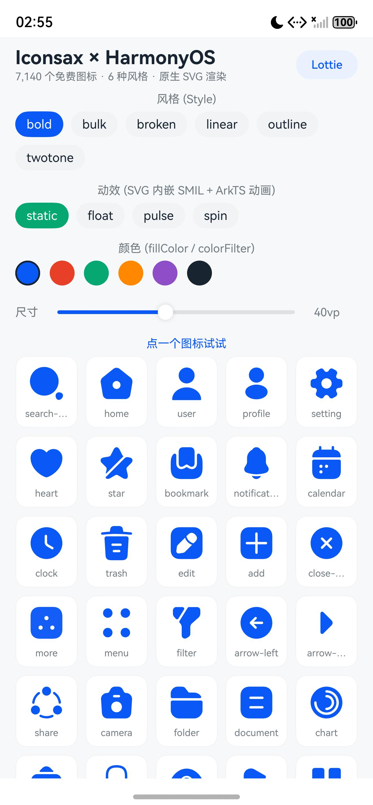
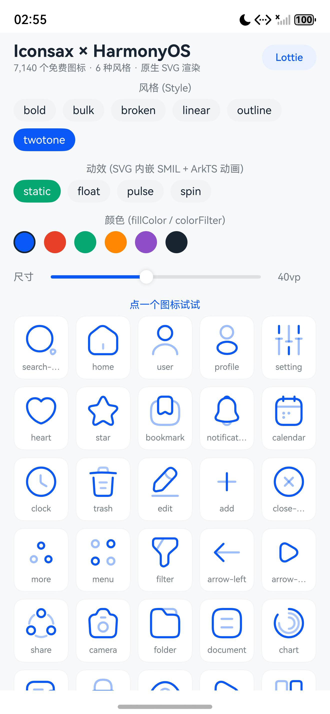
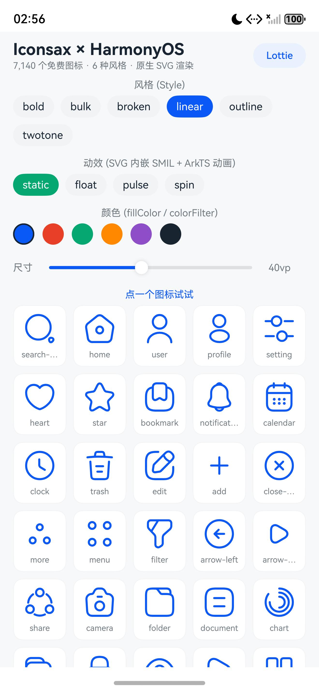
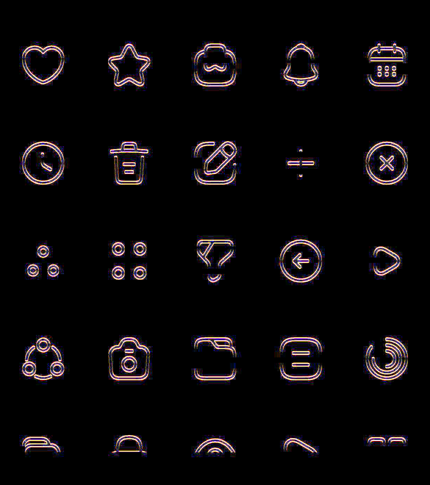
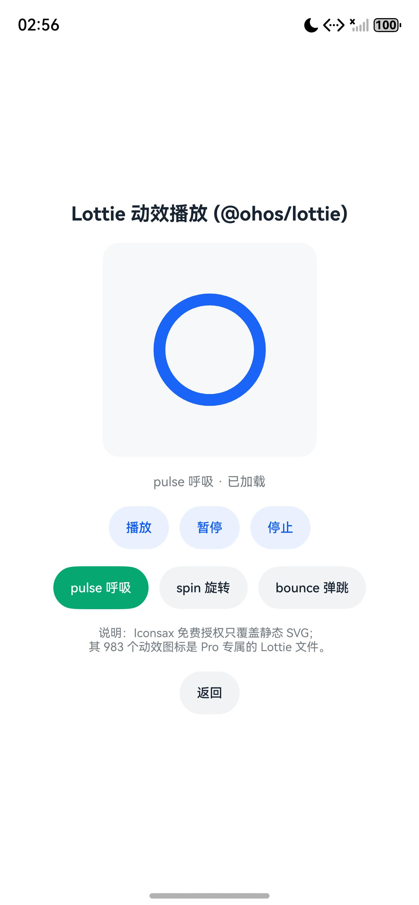

# Iconsax 图标 / 动效 在 HarmonyOS 上能不能用？

> 这是仓库版。原版报告里的本地绝对路径已改成仓库内相对路径；
> 截图位于 `docs/screenshots/`。
>
> **关于图标文件**：本报告提到的那些 SVG 不随包分发（Iconsax 授权不允许再分发图标本体）。
> 装好之后先跑 `node skills/harmonyos-ui-icons/scripts/bootstrap.mjs` 从官方 CDN 拉取并解密，报告里说的一切就能复现。

> 结论先行：**能用，而且免费的那 7,140 个静态图标是"零依赖、系统原生"直接可用**（已在真机模拟器上跑通并截图）。
> 但要注意一点：**Iconsax 的"动效图标"（983 个）属于 Pro 付费授权，免费授权里没有。**
> 想要动效，要么自己给 SVG 加 SMIL（原生、免费），要么买 Pro 后用 Lottie 库播。

调查时间：2026-10-05 ｜ 验证方式：DevEco Studio 26.0.0 + HarmonyOS 6.0.1(API 21) 模拟器实机安装运行

---

## 一、我到底从 app.iconsax.io 扒到了什么

app.iconsax.io 是个 Nuxt 单页应用，页面上看不到东西，但它把**全部资源的目录清单和文件都放在公开 CDN** 上：

| 项目 | 地址 |
| --- | --- |
| 资源 CDN | `https://cdn.iconsax.io` |
| 静态图标清单 | `/icons_parts/icons_part_1.json` … `icons_part_10.json` |
| 动效图标清单 | `/iconsax-lottie-v2.json` |
| AI 图标清单 | `/iconsax-ai.json` |
| 分类统计 | `/categories.json` `/categories_free.json` `/categories_pro.json` `/categories-lottie.json` |
| 授权说明 | `https://docs.iconsax.io/license-and-terms/license` |

### 1.1 静态图标：50,305 条记录，其中免费 7,140 条

单条记录的字段长这样：

```json
{
  "url": "/icons/free/rounded/ai/bold/ai-ac_artificial-intelligence-analytics-computation-machine-learning-data.svg",
  "name": "ai-ac",
  "tier": "free",
  "term": "rounded",
  "category": "ai",
  "style": "bold",
  "id": "d48ed23d2d7b"
}
```

- **总计 50,305 条**：`free` 7,140 条 + `pro` 43,165 条
- **免费的那批只有 `rounded`（圆角）一种外形**，但给了 6 种样式：
  `bold` / `bulk` / `broken` / `linear` / `outline` / `twotone`
- 覆盖 35 个生活/UI 类目（arrow 388、money 468、security 168、essential 605…），其中 989 个图标名在 6 种样式下都齐全
- 文件名里还塞了 SEO 关键词（`ai-ac_artificial-intelligence-analytics-…svg`），解析时取第一个 `_` 之前的部分就是图标名

### 1.2 动效图标：983 个，但 **是 Pro 专属**

`/iconsax-lottie-v2.json` 里是 983 条：

```json
{
  "url": "/jsons/arrow/arrange-circle_arrow_circle-layout-positioning-arrangement-organization-design.json",
  "name": "arrange-circle",
  "id": "i2dv6trn"
}
```

它们**没有 `tier` 字段**，因为前端的判定逻辑是：

```js
// 从 app.iconsax.io 的前端 bundle 里扒出来的判定
const isAnimated = props.item.url.includes("/jsons/");
if (props.item.tier !== "free" || isAnimated) {
  if (!access.loggedIn) { startAuth(); return; }
  if (!access.isPro) { NOTI("Solo para usuarios Pro"); return; }   // 需要 Pro
}
```

定价页也写得明明白白：

| | 免费 | Pro（$9.99/月） |
| --- | --- | --- |
| 图标数量 | 7,000（6 种圆角样式） | 44,250 |
| 格式 | SVG / PNG / WebP | + 字体 |
| **动效图标** | ❌ | ✅ 1,000 个 |
| 保存项目 | ❌ | ✅ |

### 1.3 一个有意思的实现细节：资源是加密的

CDN 上的 SVG 和 Lottie JSON **不是明文**，全是 CryptoJS 的 AES 密文（Base64 以 `U2FsdGVkX1`（`Salted__`）开头）：

```js
// app.iconsax.io 前端源码
const SECRET_KEY = "123qwe";
const bytes = CryptoJS.AES.decrypt(svgx, "123qwe");
const rawSvg = bytes.toString(CryptoJS.enc.Utf8);
```

也就是 OpenSSL 格式的 `AES-256-CBC` + `EVP_BytesToKey(MD5, salt)`。我用 Node 写的 `crypto` 复刻了这个派生逻辑，把 SVG 和 Lottie 都成功解出来了（脚本见 `iconsax-research/decrypt.js`）。

解出来的 SVG 长这样（`/icons/free/rounded/ai/bold/ai-ac_….svg`）：

```xml
<svg width="24" height="24" viewBox="0 0 24 24" fill="none" xmlns="http://www.w3.org/2000/svg">
<g clip-path="url(#clip0_3261_13110)">
  <path d="M8.51 21.96C8.1 21.96 …" fill="white"/>
  …
</g>
<defs><clipPath id="clip0_3261_13110"><rect width="24" height="24" fill="white"/></clipPath></defs>
</svg>
```

> ⚠️ 注意：6 种样式其实是**两套完全不同的画法**，这直接决定了 HarmonyOS 侧怎么上色：
> - **填充型**（`bold` / `bulk` / `outline`）：`<path fill="white">`
> - **描边型**（`linear` / `twotone` / `broken`）：`<path stroke="white" fill=none>`
> - 全部硬编码成 **白色**，所以在浅色背景上不改色就是"隐形"的

### 1.4 授权范围（原文要点，`docs.iconsax.io/license-and-terms/license`）

**免费授权（1. ICONSAX FREE LICENSE）**
- 费用：免费；使用者：1 人（个人）；期限：永久
- 用途：**个人 + 商用，不限量**，可以集成进你的最终产品
- 修改/组合：**随便改**
- 署名：**不需要**（例外：把图标当"数字商品"卖，比如 UI Kit / 模板 / 主题，则强制署名）
- 明确允许：「Embedding Free icons in a mobile app or software you develop」——**把免费图标嵌进 App 完全合规**
- 禁止：**转售 / 再分发图标本体**（单个或打包都不行）；把改过的图标当新图标集卖

**Pro 授权**：才有 40k+ 静态 + **动效图标** + AI + 字体

**结论：做 App 用免费图标 = 没问题；想用它的动效 = 得买 Pro。**

---

## 二、HarmonyOS 侧的能力边界（官方文档）

数据来源：OpenHarmony 官方文档仓（ArkUI 部分，HarmonyOS 与之一致）
- `reference/apis-arkui/arkui-ts/ts-basic-components-image.md`
- `reference/apis-arkui/arkui-ts/ts-basic-svg.md`（SVG 标签说明）
- `reference/apis-arkui/arkui-ts/ts-image-svg2-capabilities.md`

### 2.1 Image 组件原生支持 SVG

`Image` 从 **API 7** 起就支持 `svg` 格式（和 png/jpg/webp/gif/heif 并列），**不需要任何三方库**。
支持范围是 **SVG 1.1 规范的一个子集**。

**支持的标签 / 属性：**

| 类别 | 支持内容 |
| --- | --- |
| 基础形状 | `<rect>` `<circle>` `<ellipse>` `<line>` `<polyline>` `<polygon>` `<path>` |
| 通用属性 | `id` `fill` `fill-rule` `fill-opacity` `stroke` `stroke-dasharray` `stroke-dashoffset` `stroke-opacity` `stroke-width` `stroke-linecap` `stroke-linejoin` `stroke-miterlimit` `opacity` `transform` `clip-path` `clip-rule` |
| 结构 | `<svg>` `<g>` `<use>` `<defs>` |
| 裁剪/遮罩/图案 | `<clippath>` `<mask>` `<pattern>` |
| 渐变 | `<linearGradient>` `<radialGradient>` `<stop>` |
| 滤镜 | `<filter>` `<feOffset>` `<feGaussianBlur>` `<feBlend>` `<feComposite>` `<feColorMatrix>` `<feFlood>` |
| 位图 | `<image>`（`href` 支持 jpg/png/webp/heic/base64，**不支持再引 SVG**） |
| **动画** | **`<animate>`、`<animateTransform>`** |

**不支持（踩坑点）：**
- ❌ CSS：`<style>` 标签、class 选择器、CSS animation 全都不认
- ❌ `<text>` / `<tspan>`（文字要转成 path）
- ❌ `<set>` `<animateMotion>` `<mpath>`（事件触发的动画也没有）
- ❌ 基础形状的 `transform` 在 API 21 之前**只支持平移**，不支持旋转/缩放/矩阵（`supportSvg2` 打开后才支持）
- ❌ `Image` 组件不支持用 Base64 字符串加载 SVG
- ❌ SVG 图源不支持 `objectFit` 之外的多数图像属性：`renderMode`、`interpolation`、`syncLoad`、`imageMatrix`、`orientation` 等对 SVG 都无效

Iconsax 的 SVG 只用到 `<g clip-path>` + `<path>` + `<defs>/<clipPath>` + `<rect>`，**全在支持范围内**。

### 2.2 动效：SVG 内嵌 SMIL 是被支持的！

这是最关键的发现。官方在 `<animate>` / `<animateTransform>` 一节写明：

> 当前仅支持**单个元素的属性动画或者变形动画**，不支持元素间动画嵌套。

| 标签 | 支持的 `attributeName` | 其它 |
| --- | --- | --- |
| `<animate>` | `cx` `cy` `r` `fill` `stroke` `fill-opacity` `stroke-opacity` `stroke-miterlimit` | `begin` `dur` `from` `to` `fill` `calcMode` `keyTimes` `values` `keySplines` |
| `<animateTransform>` | `transform`，`type` = `translate` \| `scale` \| `rotate` \| `skewX` \| `skewY` | 同上 |

配套还有两个东西：
- **`Image.onFinish()`**：带动效的 SVG 播放完成时回调（无限循环的不会触发）——可以拿来做"播完一次就停在终点"的图标
- **`supportSvg2`（API 21+）**：打开后按标准 SVG 1.1 解析，颜色从 `#ARGB` 改成标准 `#RGBA`，`transform` 支持旋转/缩放/矩阵，`clipPathUnits` / `gradientUnits` / `maskUnits` 等单元属性也支持了

> 版本提醒：`supportSvg2` 是 **API 21**（HarmonyOS 6.0.x）才有的。**HarmonyOS 5.0.x（API 12~15）上没有这个开关**，行为是"旧解析器"。
> 好消息是：**旧解析器对 Iconsax 这版 SVG 完全够用**，下面的实机验证就是跑在旧行为上的。

### 2.3 上色：两条不同的路（这是最容易翻车的地方）

`Image` 对 SVG 有两个上色接口，**适用场景不一样**：

| 接口 | 文档描述 | 适合 |
| --- | --- | --- |
| `fillColor(color)` | "替换 SVG 图片中所有可绘制元素的**填充**颜色" | 填充型图稿（`bold`/`bulk`/`outline`） |
| `colorFilter(4x5 矩阵)` | "SVG 类型的图源**只有设置了 stroke 属性（无论是否有值）才会生效**" | 描边型图稿（`linear`/`twotone`/`broken`） |

**所以我做了一件事：把"白色图稿"当亮度蒙版，用乘法矩阵着色。**
目标色 `(r,g,b)` → 矩阵把白色 `(1,1,1)` 映射成 `(r,g,b)`，双色图标的 0.4 透明度也自动保留成浅色：

```ts
static multiplyMatrix(color: string): ColorFilter {
  const [r, g, b] = Tint.parseHex(color);
  return [
    r, 0, 0, 0, 0,
    0, g, 0, 0, 0,
    0, 0, b, 0, 0,
    0, 0, 0, 1, 0
  ];
}
```

### 2.4 Lottie：需要第三方库 `@ohos/lottie`

- ohpm 包名：`@ohos/lottie`，最新 **2.0.33**，**MIT 协议**
- 仓库：`gitcode.com/CPF-ApplicationTPC/lottieArkTS`（原 gitee `openharmony-tpc/lottie`）
- 用法：`Canvas` + `CanvasRenderingContext2D`，`lottie.loadAnimation({ container, renderer:'canvas', path:'lottie/x.json', … })`
- 支持 `play/pause/stop/setSpeed/goToAndStop/changeColor/setContentMode` 等
- 作者另外推荐了性能更好的 **lottie-turbo**（声明式、支持子线程渲染）

---

## 三、实机验证：真的跑起来了

我没有停在"读文档"，而是**把工程建出来、编译、签名、装到模拟器上跑、截图**。

### 3.1 环境与结果

| 项目 | 值 |
| --- | --- |
| DevEco Studio | 26.0.0.821 |
| SDK | HarmonyOS 26.0.0 (API 26)，编译目标 `compatibleSdkVersion 5.0.0(12)` |
| hvigor | 6.26.4 |
| 运行设备 | 本机 HarmonyOS 模拟器，`emulator 6.0.0.112`，**API 21** |
| 产物 | `entry-default-signed.hap` **2.93 MB**（含 843 个 SVG + Lottie 库） |
| 安装启动 | `hdc install` / `aa start` 均成功 |

> ⚠️ 顺带发现一个大坑：**hvigor 不允许工程路径里出现非 ASCII 字符**。
> 本工作区目录名是「鸿蒙」，直接在原地构建会报 `Specification Limit Violation: Invalid project path`。
> 所以 `build.ps1` 会先把工程镜像到 `C:\VibeCoding\DeepSeek\iconsax-harmony-build` 再编译。

### 3.2 截图证据

**① `bold` 样式（填充型）→ `Image.fillColor()`**
36 个图标全部正常渲染并正确着色：



**② `twotone` 样式（描边型）→ `Image.colorFilter()` 乘法矩阵**
注意双色调的浅色部分（0.4 opacity）也被正确保留 —— 说明 `colorFilter` 这条路走通了：



**③ `linear` 样式（纯描边）→ `colorFilter()`**



**④ SVG 内嵌 SMIL 动效真的在动**
切到 `float` 动效后连拍两帧做像素差：图标网格区域有 **4.56% 的像素发生变化**，说明 `<animateTransform type="translate">` 被系统 SVG 解析器执行了，**没有用任何第三方库**：



**⑤ Lottie 动效播放成功**
`@ohos/lottie` 加载 `rawfile/lottie/pulse.json`，日志确认 `animation activated with 25 fps`，画面渲染正常，运行时 `changeColor` 改色也生效：



### 3.3 中途真实踩到的坑（都已修掉）

| 现象 | 原因 | 修法 |
| --- | --- | --- |
| `Property 'scale' in type 'IconsaxIcon' is not assignable to the same property in base type 'CustomComponent'` | 自定义组件的 `@Prop` **不能叫** `scale` / `size` / `rotate` / `translate`，会撞上通用属性方法 | 全部加 `ic` 前缀：`icScale` `icSize` `icAngle` |
| `Cannot find name 'keyframeAnimateTo'` | 全局动画函数在新版已弃用 | 改用 `this.getUIContext().keyframeAnimateTo(...)` |
| `main_pages.json file format is invalid` | PowerShell 写文件带了 UTF-8 BOM | 用无 BOM 写入 |
| 某个格子空白 | 目录里漏了 `profile` 的 SVG 文件 | 补齐资源 + 加断言校验 |
| `Invalid project path` | 路径含中文 | 镜像到 ASCII 路径构建 |

---

## 四、给你的落地方案

### 方案 A：纯免费（推荐）——静态 SVG + ArkTS 动效

零依赖、零授权风险、包体最小。图标直接放 `resources/rawfile/`，ArkTS 里一个组件搞定：

```ts
import { Tint } from '../common/Tint';

@Component
export struct IconsaxIcon {
  @Prop rawfile: string = '';
  @Prop icSize: number = 40;
  @Prop icTint: string = '#182431';
  @Prop strokeArtwork: boolean = false;   // linear/twotone/broken 为 true

  build() {
    if (this.strokeArtwork) {
      Image($rawfile(this.rawfile))
        .width(this.icSize).height(this.icSize)
        .objectFit(ImageFit.Contain)
        .colorFilter(Tint.multiplyMatrix(this.icTint))   // 描边型走矩阵
    } else {
      Image($rawfile(this.rawfile))
        .width(this.icSize).height(this.icSize)
        .objectFit(ImageFit.Contain)
        .fillColor(this.icTint)                          // 填充型走 fillColor
    }
  }
}
```

动效三层叠加，全都不需要三方库：

1. **图标自身动效** —— 把 `<animateTransform>` / `<animate>` 塞进 SVG（我用脚本给 35 个图标 × 6 样式批量生成了 `float`/`pulse`/`spin` 三套，共 630 个文件，脚本见 `iconsax-research/make_animated_svg.js`）：
   ```xml
   <path d="…" fill="white">
     <animateTransform attributeName="transform" type="translate"
       values="0 0; 0 -2; 0 0" keyTimes="0; 0.5; 1" dur="1.6s" repeatCount="indefinite"/>
   </path>
   ```
2. **组件属性动画** —— `this.getUIContext().animateTo()` / `keyframeAnimateTo()` 驱动 `.scale()` `.translate()` `.rotate()`
3. **页面转场 / 共享元素** —— `geometryTransition` + `TransitionEffect`

### 方案 B：要 Iconsax 原版动效 → 买 Pro + `@ohos/lottie`

```bash
ohpm install @ohos/lottie     # MIT
```

```ts
import lottie, { AnimationItem } from '@ohos/lottie';

Canvas(this.ctx).onReady(() => {
  this.item = lottie.loadAnimation({
    container: this.ctx,
    renderer: 'canvas',
    loop: true,
    autoplay: true,
    name: 'iconsaxDemo',
    contentMode: 'Contain',
    path: 'lottie/your-icon.json'        // 相对 resources/rawfile
  });
  this.item.addEventListener('DOMLoaded', () => {
    this.item?.changeColor([10, 89, 247, 1]);   // 运行时改色
  });
})
```

> 我的演示里 **没有** 放 Iconsax 的动效文件——那是 Pro 资产，免费授权不含、也不能再分发。
> 演示用的 3 个 Lottie 是我用脚本原创生成的（`iconsax-research/make_lottie.js`），你换成自己的或买 Pro 后的文件即可。

### 选型建议

| 场景 | 建议 |
| --- | --- |
| 普通 App 界面图标（返回、搜索、设置…） | **方案 A**：免费静态 SVG + `fillColor`/`colorFilter` |
| 需要"图标自己会动"（加载、成功反馈、呼吸提示） | **方案 A**：给 SVG 加 SMIL，或 ArkTS 属性动画 |
| 复杂 AE 级动效（多图层、路径变形、粒子） | **方案 B**：Lottie（`@ohos/lottie` 或 `lottie-turbo`） |
| 想要 Iconsax 那 983 个现成动效 | 只能买 Pro，且注意授权禁止再分发 |

---

## 五、避坑清单（按重要性排序）

1. **白色硬编码** —— Iconsax 原生 SVG 全是 `fill="white"` / `stroke="white"`，不改色在浅色主题下完全看不见。必须用 `fillColor` 或 `colorFilter`，或者自己做构建期替换。
2. **两套上色 API** —— 填充型用 `fillColor`，描边型必须用 `colorFilter`（文档明确：SVG 图源要"设置了 stroke 属性"才生效）。写成一套会在某几种样式上失效。
3. **动效要花钱** —— 免费只有静态 SVG，983 个 Lottie 动效是 Pro 的。
4. **CDN 资源加密** —— 想批量拿图标，得复刻 CryptoJS 的 `123qwe` 解密；更稳的做法是走官方 Figma 插件 / 官网下载，也符合授权里"always download from official source"的要求。
5. **`<style>` / CSS 动画不支持** —— Iconsax 的 SVG 恰好没用 CSS，但如果换成别的图标库（比如很多 SVG 用 `<style>` + class），在 ArkUI 里会掉样式。
6. **不要用 `<text>`** —— ArkUI 的 SVG 解析器不认，文字必须转 path。
7. **API 21 行为会变** —— `supportSvg2` 打开后颜色解析从 `#ARGB` 变 `#RGBA`，`fillColor` 对 `fill="none"` 不再生效。跨版本发版要实测。
8. **hvigor 路径必须是 ASCII** —— 工程放中文目录会直接构建失败。
9. **免费只有 `rounded` 一种外形** —— 想要直角/直边风格得买 Pro。
10. **授权红线** —— 可以嵌进 App 卖，但**不能把图标本体（或改过的版本）当素材再分发/转售**。

---

## 六、交付物清单

调查和验证过程产出的东西，现在都收在这个仓库里：

```
harmonyos-ui-icons/
├─ README.md                          ← 仓库说明
├─ SKILL.md                           ← DSH 技能定义（触发条件 + 工作流）
├─ assets/
│  ├─ iconsax/<style>/<name>.svg      ← 1,083 个免费静态 SVG（已解密）
│  └─ iconsax-anim/<fx>/<style>/<name>.svg  ← 3,249 个 SMIL 动效 SVG（脚本生成）
├─ templates/                         ← 三个 ArkTS 模板（已过真实编译）
├─ catalog/                           ← 7,140 个免费图标索引 + 精选名单
├─ scripts/                           ← 下载解密 / 注入 SMIL
├─ references/                        ← ArkUI 能力边界 / 授权 / 踩坑清单
├─ examples/                          ← 验证用示例页 + 复现脚本
└─ docs/
   ├─ feasibility-report.md           ← 本文
   └─ screenshots/                    ← 实机截图 + 动效帧差图
```

### 复现验证

```bash
# 路径均相对于技能根目录 skills/harmonyos-ui-icons/

# 1) 初始化图标（拉取 + 解密 + 生成动效，一条命令）
node scripts/bootstrap.mjs

# 2) 需要更多图标时按需拉
node scripts/fetch-icons.mjs --out ./assets/iconsax --names home,user,setting

# 3) 生成别的动效变体
node scripts/make-animated-svg.mjs \
  --in ./assets/iconsax --out ./assets/iconsax-anim \
  --effects float,pulse,wiggle

# 4) 把模板和图标拷进你的鸿蒙工程，然后
hvigorw assembleHap --mode module -p product=default -p buildMode=debug --no-daemon
```

> 本包已经提供两个现成脚本：
> `examples/validate-bundle.mjs`（DSH 技能包契约校验）和
> `examples/verify-templates.ps1`（把 ArkTS 模板塞进真实工程编译验证）。

> **关于本机验证时的两个细节**：
> 一是 hvigor 不接受含非 ASCII 字符的工程路径，所以本机上是用脚本先把工程镜像到一个纯 ASCII 路径再编译的；
> 二是实机安装用的 bundleName 与本机现成的一个调试签名 profile 绑定，换到你自己的工程时请用 DevEco 的「自动签名」重新生成。

---

## 七、已经把它做成 DeepSeek Harness Skill 了

上面的东西不再只是一份报告 —— 已经打包成一个 DSH 技能，
**在 DSH 里做鸿蒙前端界面时会自动带着这套图标库出场。**

### 结构

本仓库根目录就是一个可直接安装的 DSH 技能：

```
harmonyos-ui-icons/                   ← 仓库根 = 技能根
├─ SKILL.md                          技能主文件（触发条件 + 标准工作流）
├─ assets/
│  ├─ iconsax/<style>/<name>.svg     181 个常用图标 × 6 样式 = 1083 个，已解密
│  └─ iconsax-anim/<fx>/<style>/<name>.svg   3249 个 SMIL 动效变体
│                                    fx ∈ { float, pulse, wiggle }
├─ templates/
│  ├─ IconsaxIcon.ets                图标渲染组件（双上色路线 + onFinish 回调）
│  ├─ Tint.ets                       乘法着色矩阵 / 颜色工具
│  └─ IconsaxCatalog.ets             181 个图标的中文目录（自动生成）
├─ catalog/
│  ├─ iconsax-free-index.json        全部 7,140 个免费图标索引
│  └─ curated-names.json             离线内置的 181 个图标名
├─ scripts/
│  ├─ fetch-icons.mjs                按需从官方 CDN 拉取 + 解密（支持搜索/类目/批量）
│  └─ make-animated-svg.mjs          给任意静态 SVG 批量注入 SMIL 动效
└─ references/
   ├─ arkui-svg-capability.md        ArkUI 对 SVG / 动效 / Lottie 的能力边界
   ├─ license.md                     Iconsax 授权要点与红线
   └─ pitfalls.md                    12 条实机踩坑清单
```

装到 DSH 里就是把它放到 `$DSH_HOME/skills/` 下：

```powershell
git clone <本仓库> "$env:DSH_HOME\skills\harmonyos-ui-icons"
```

合计 **7.61 MB / 4,343 个文件**，全部离线可用。

### 会怎么触发

技能描述里写死了触发场景，只要任务沾上这些就会自动加载：

> ArkTS / ArkUI / DevEco Studio / 鸿蒙页面、组件、TabBar、底部导航、列表、卡片、按钮、
> 状态栏、空状态；或者你说"找个图标""加个图标""画个 icon""鸿蒙 UI"；
> 哪怕只是"做个鸿蒙页面""帮我搭个 App 界面"。

### 能干的四件事

| 能力 | 怎么做 |
| --- | --- |
| **拿图标** | 181 个常用图标已离线就位直接拷；不够就 `fetch-icons.mjs --search <kw>` 从 1,101 个名字里搜，按需下载解密 |
| **上色** | 拷 `Tint.ets` + `IconsaxIcon.ets`，填充型走 `fillColor`、描边型走 `colorFilter`，组件里已经分好支 |
| **做动效** | 3249 个 SMIL 动效变体直接拷；或用 `make-animated-svg.mjs` 现生成 `float/pulse/spin/wiggle/beat` 五种 |
| **避坑** | 换库/报错/上色不生效时读 `references/` 三份文档，不用再重新踩一遍 |

### 已做的验证

不只是写文档，**模板代码本身也过了一遍真实编译 + 实机运行**：

| 验证项 | 结果 |
| --- | --- |
| `templates/` 三个 ArkTS 文件塞进真实工程编译 | ✅ `BUILD SUCCESSFUL` |
| `IconsaxIcon` 填充型分支（`fillColor`） | ✅ 蓝色实心图标正确渲染 |
| `IconsaxIcon` 描边型分支（`colorFilter`） | ✅ 蓝色线框图标正确渲染 |
| SMIL 动效 SVG（`float`/`pulse`） | ✅ 正常播放 |
| **单次动效 + `onPlayed` 回调** | ✅ 实机日志显示回调真的触发了 |
| `@Prop icSize: number \| string` 联合类型 | ✅ `'36vp'` 正常渲染 |
| `make-animated-svg.mjs --effects spin` | ✅ 从 skill 目录运行成功 |
| `Tint` 工具方法（矩阵 / Lottie RGBA / 判定） | ✅ 实机 hilog 输出正确 |

截图：`screenshots/shot-07-skill-templates.jpeg`

